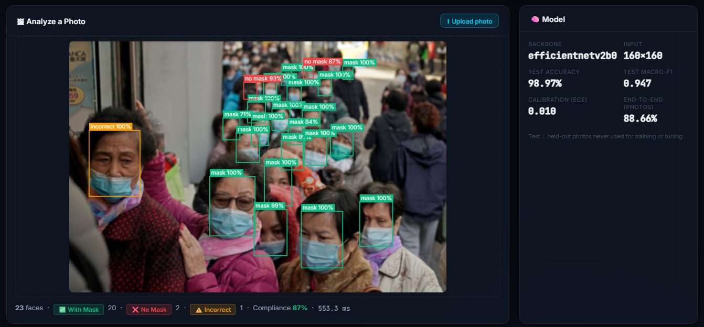
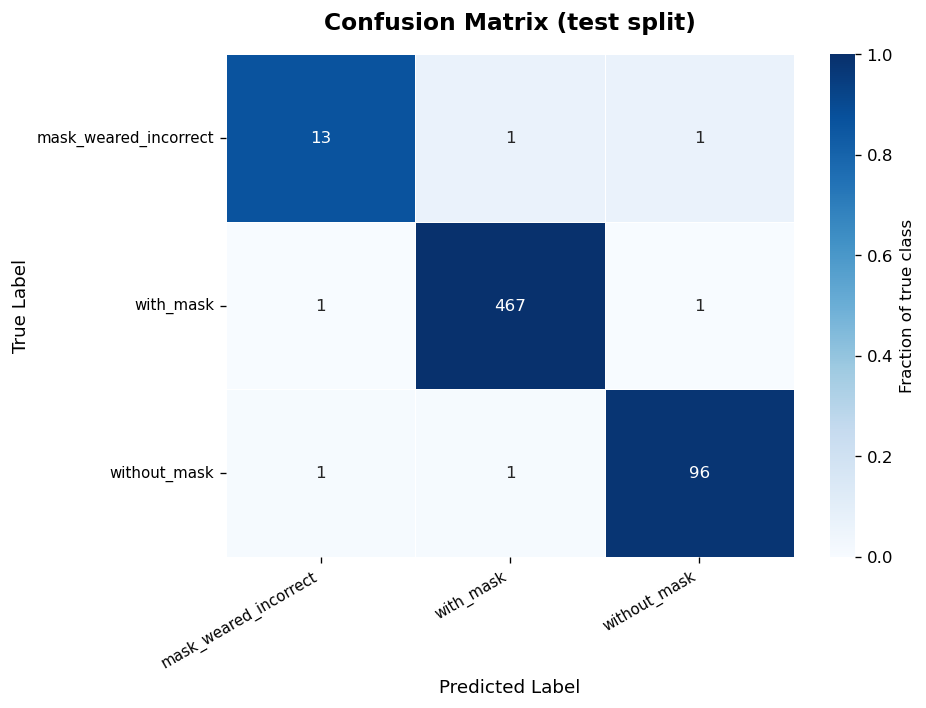
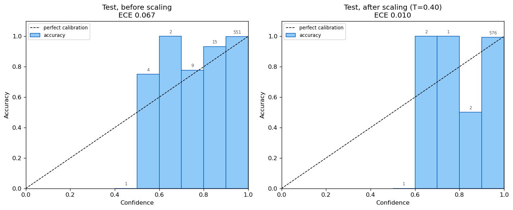
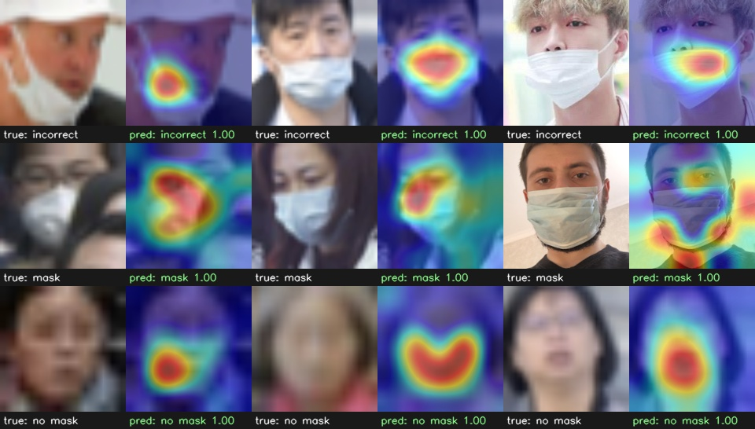

# 🎭 Face Mask Detection

Detects faces in images, video and webcam streams and classifies each one as
**with mask**, **without mask** or **mask worn incorrectly**. Includes a web
dashboard, a REST API, calibrated confidences, Grad-CAM explanations and a
TensorFlow Lite export.



## Results

All numbers are on a **held-out test split**: photos never used for training,
model selection or calibration. The split is done per photo, so faces from
one photo can't end up in both train and test.

**Classifier** (EfficientNetV2-B0, 582 test faces, flip TTA):

| | precision | recall | F1 | faces |
|---|---:|---:|---:|---:|
| with mask | 0.996 | 0.996 | 0.996 | 469 |
| without mask | 0.980 | 0.980 | 0.980 | 98 |
| mask worn incorrectly | 0.867 | 0.867 | 0.867 | 15 |

- **Accuracy 98.97%** (576 of 582 faces)
- Macro-F1 0.947, balanced accuracy 94.73%, macro ROC-AUC 0.999
- Calibration error (ECE) 0.0096 after temperature scaling (0.0665 before)

**Full pipeline on the original test photos** (face detector + classifier;
a face counts as correct only if it was found *and* classified correctly):

| face detector | faces found | classifier accuracy on found faces | end-to-end accuracy |
|---|---:|---:|---:|
| YuNet + small-image upscaling (default) | 89.9% | 98.7% | **88.7%** |
| YuNet, no upscaling | 76.8% | 97.5% | 74.9% |
| ResNet-10 SSD (legacy) | 34.5% | 100% | 34.5% |

The limiting factor is detection of tiny faces. The detector finds 95% of test
faces at least 16 px across, but only 71% of smaller ones. The missed faces
have a median size of 14 px.

**Deployment** (one face with flip TTA, Intel i7-1255U CPU):

| model | size | test accuracy | latency |
|---|---:|---:|---:|
| Keras | 24.8 MB | 98.97% | 33.6 ms |
| TFLite fp16 (default when exported) | 11.9 MB | 98.97% | 20.5 ms |
| TFLite int8 | 6.7 MB | 98.97% | 27.6 ms |

<p>
  
  
</p>

Grad-CAM shows the model looking at the nose, mouth and mask region:



## Features

- **3 classes**: `with_mask`, `without_mask`, `mask_weared_incorrect`
- **YuNet face detector**: small frames are upscaled before detection, which
  raised face recall on the test photos from 76.8% to 89.9%
- **Calibrated confidences** via temperature scaling: 0.9 means right about 90% of the time
- **Temporal smoothing**: faces are tracked with optimal assignment, and each
  face's class probabilities are averaged over frames. One blurry frame doesn't
  flip a label or raise an alert.
- **Web dashboard**: live stream, compliance charts, violation log, photo
  upload analysis and model metrics
- **REST API**: `POST /api/predict` returns every face as JSON
- **Explainability**: Grad-CAM heatmaps (`explain.py`)
- **TFLite export**, checked against the Keras model on the test set (`export.py`)
- **Batch tools**: images and folders with JSON/CSV reports, and video files
- **Tests** (pytest), **GitHub Actions CI** and a **Dockerfile**

## Quick start

```bash
pip install -r requirements.txt

python app.py                       # dashboard at http://127.0.0.1:5000
python detect_realtime.py           # webcam window (Q quits, S screenshot, H heatmap)
python detect_image.py --image photo.jpg
python detect_image.py --dir photos/ --output-dir results/ --json results/report.json --csv results/faces.csv
python detect_video.py --video input.mp4 --output annotated.mp4
```

The trained model (`models/mask_detector.keras`) and the YuNet detector are in
the repo, so no training is needed first. For faster CPU inference, export the
TFLite model once; it is then used automatically:

```bash
python export.py        # its accuracy check needs the prepared dataset (see below)
```

### REST API

```bash
curl -F image=@photo.jpg http://127.0.0.1:5000/api/predict
curl -F image=@photo.jpg "http://127.0.0.1:5000/api/predict?annotate=1" -o annotated.jpg
```

```json
{
  "faces": [
    {"box": [21, 95, 75, 165], "face_confidence": 0.9205,
     "label": "mask_weared_incorrect", "confidence": 0.9961,
     "scores": {"mask_weared_incorrect": 0.9961, "with_mask": 0.0036, "without_mask": 0.0002},
     "violation": true}
  ],
  "counts": {"total": 23, "with_mask": 20, "without_mask": 2, "mask_weared_incorrect": 1},
  "compliance_pct": 87.0,
  "image_size": [400, 267],
  "inference_ms": 470.9
}
```

| Endpoint | Method | Description |
|---|---|---|
| `/api/predict` | POST | Analyse a photo (form field `image` or raw body; `?annotate=1` returns a JPEG) |
| `/api/model` | GET | Backbone, temperature, test and end-to-end metrics |
| `/video_feed` | GET | MJPEG live stream |
| `/api/stats` | GET | Current detection statistics |
| `/api/timeline` | GET | Compliance time series |
| `/api/logs` | GET | Recent violations (`?n=50`) |
| `/api/logs/download` | GET | Download `violations.csv` |
| `/api/stream/start`, `/api/stream/stop` | POST | Start / stop the camera |
| `/api/screenshot`, `/api/heatmap` | POST | Save the current frame / a position heatmap |
| `/api/reset` | POST | Reset session stats and logs |

Uploads over 10 MB are rejected (`MAX_UPLOAD_MB` in `config.py`).

### Docker

```bash
docker build -t face-mask-detection .
docker run -p 5000:5000 face-mask-detection
```

This serves the dashboard and API with gunicorn. The live stream needs a
camera passed into the container (`--device /dev/video0` on Linux).

## Reproducing the model

```bash
python download_dataset.py     # Kaggle "andrewmvd/face-mask-detection": crops faces, splits by photo
python train.py                # keeps the checkpoint with the best val macro-F1
python evaluate.py             # test split: report, confusion matrix, ROC, error gallery
python calibrate.py            # fits the temperature on val, stores it in models/model_info.json
python evaluate_pipeline.py    # detector + classifier on the original test photos
python export.py               # TFLite fp16 / int8 with accuracy and latency checks
python explain.py --test-samples 3
```

**Data**: 853 photos with 3,603 labelled faces of at least 10 px, split by photo
into 2,458 train, 563 val and 582 test faces. The "incorrect" class is rare:
92 training faces and 15 test faces.

**Training**: ImageNet-pretrained EfficientNetV2-B0 at 160×160 px. The head
trains for 3 epochs on the frozen backbone. The whole backbone is then
fine-tuned (BatchNorm frozen) with AdamW, a 1-epoch warm-up, cosine decay and
label smoothing 0.1. Batches oversample rare classes (sampling ∝ count^0.5).
Augmentation includes low-resolution simulation, because most real faces are
tiny. The saved run stopped early after 24 epochs.

## How it works

```
frame ─► YuNet face detector (small frames upscaled first)
      ─► square crops with 15% context, framed the same way as training
      ─► EfficientNetV2-B0 classifier, averaged with its mirrored copy
      ─► temperature scaling (T = 0.40)
      ─► tracker: per-face probability smoothing across frames (video/webcam)
      ─► boxes, counts, compliance, alerts, logs
```

## Project structure

```
├── app.py                 Flask dashboard + REST API
├── pipeline.py            detect + classify one image -> JSON-ready dict
├── face_detector.py       YuNet (default) / SSD face detection, small-image upscaling
├── mask_detector.py       classifier inference: flip TTA, calibration, Keras or TFLite
├── tracker.py             centroid tracker with optimal matching and probability smoothing
├── detect_realtime.py     webcam
├── detect_video.py        video files
├── detect_image.py        images and folders, JSON/CSV reports
├── model.py               EfficientNetV2 / MobileNetV2 classifier definition
├── data_pipeline.py       tf.data input, class rebalancing, augmentation
├── train.py               two-phase training
├── evaluate.py            test-split metrics and plots
├── evaluate_pipeline.py   end-to-end detector + classifier evaluation
├── calibrate.py           temperature scaling, ECE, reliability diagram
├── export.py              TFLite export and verification
├── explain.py             Grad-CAM
├── download_dataset.py    Kaggle download, face cropping, photo-level split
├── alert_system.py, analytics.py, logger.py, utils.py, config.py
├── models/                trained model, YuNet, metrics JSON, plots
├── static/, templates/    dashboard front end
├── tests/                 pytest suite
└── Dockerfile, .github/workflows/tests.yml
```

## Configuration

Everything lives in `config.py`. The settings you are most likely to change:

| Setting | Default | Meaning |
|---|---|---|
| `FACE_DETECTOR_BACKEND` | `yunet` | `yunet` or `ssd` |
| `FACE_CONFIDENCE_THRESHOLD` | 0.5 | face detector score cut-off |
| `DETECT_UPSCALE_TO` | 800 | enlarge smaller frames to this longer side before detection (0 = off) |
| `MASK_CONFIDENCE_THRESHOLD` | 0.6 | minimum calibrated confidence for a violation |
| `MASK_RUNTIME` | `auto` | `auto` (TFLite if exported), `keras` or `tflite` |
| `MASK_TTA` | True | average each face with its mirror image |
| `TRACK_SMOOTHING` | 0.5 | weight of the newest frame per face (1 = no smoothing) |
| `CAMERA_INDEX` | 0 | webcam index |

## Tests

```bash
pip install -r requirements-dev.txt
python -m pytest            # 43 tests; the model tests skip without TensorFlow
```

## Limitations

- The "mask worn incorrectly" class has only 15 test faces, so its 86.7%
  recall is a rough estimate (95% interval roughly 60–98%).
- About 10% of labelled faces in the test photos are missed by the detector,
  mostly faces under 16 px.
- All data comes from one Kaggle dataset of mostly street and crowd photos. It
  has not been audited for demographic balance, and performance on other
  cameras, lighting conditions or populations is unmeasured.
- The system detects masks, not identities. It should support human judgement,
  not replace it.

See [MODEL_CARD.md](MODEL_CARD.md) for details.
